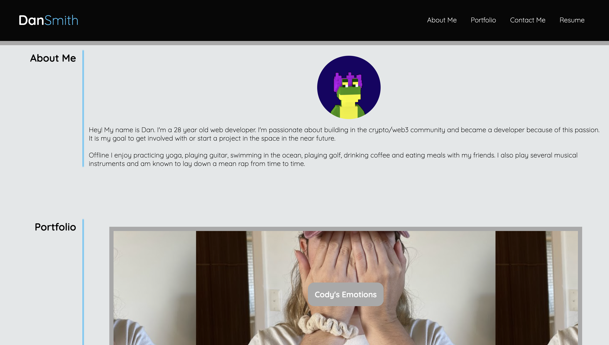

# Dan-Smith-Portfolio-02-Advanced-CSS

**Description**

This project is a website that showcases work I have done in the past and will be able to be edited to show my future work as well.

It has 4 main sections:
- About me: I give a brief description about myself both professionally and personally
- Portfolio: You can find pannels highlighting some of my previous work with placeholders for future work to come
- Contact Me: This section provides my details should anyone using the page wish to get in touch with me
- Resume: An embeded PDF version of my resume lies in this section for your perusal 

**Mockup Website Link**

Website link:
https://dansmith09.github.io/Dan-Smith-Portfolio-02-Advanced-CSS/

**Website Section Screenshots**

As the screenshots below show, the page works very well in whatever screensize your device has:

Larger Screen:

Smaller Screen:

